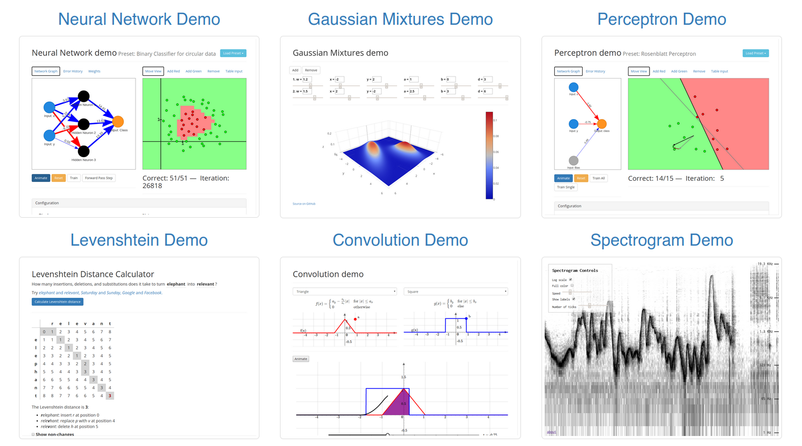

## Hi there 👋

I'm a big fan of FOSS and develop and maintain a few tools as side-projects. I also sometimes write technical and educational articles on [my blog](https://phiresky.github.io/blog/).

Here's some of my open-source work (most recent first):

### isbn-visualization: Visualizing all books of the world in ISBN-Space

An interactive visualization that maps the entire ISBN-space of over 100 million books using a custom "bookshelf" space-filling curve, allowing users to explore publication dates, publishers, and availability across the two billion possible ISBN slots.

 

This project won first prize in a book metadata visualization contest with a $10,000 prize pool.

- Article and Running Instance: https://phiresky.github.io/blog/2025/visualizing-all-books-in-isbn-space/
- Repo: https://github.com/phiresky/isbn-visualization
- Technologies: TypeScript, Rust

### Lemmy: A link aggregator for the fediverse

Lemmy is a federated alternative to Reddit. I'm currently a core maintainer, mainly working on efficient cross-instance communication.

- Repo: https://github.com/lemmyNet/lemmy
- Website: https://join-lemmy.org
- Technologies: Rust

### thought-forge-ai: An experiment in generating "deep thought" TikTok-style video including a spoken monologue, moving video scenes and music

https://github.com/user-attachments/assets/f32acff6-bdb6-43b0-9aac-cd5b993c19be

- Repo and Demo: https://github.com/phiresky/thought-forge-ai
- Technologies: TypeScript

### sqlite-zstd: Transparent dictionary-based row-level compression for SQLite

- Article: https://phiresky.github.io/blog/2022/sqlite-zstd/
- Repo: https://github.com/phiresky/sqlite-zstd
- Technologies: Rust

### timetrackrs: An automated rule-based timetracker (WIP)

- Screenshot:  
  
- Repo: https://github.com/phiresky/timetrackrs
- Technologies: Rust, SQLite, Typescript, React

### sql.js-httpvfs: Hosting SQLite databases on Github Pages

- Article: https://phiresky.github.io/blog/2021/hosting-sqlite-databases-on-github-pages/

- Technologies: TypeScript, React, SQLite, WebWorkers

### pandoc-url2cite: Effortlessly and transparently add correctly styled citations to your markdown paper given only a URL

- Screenshot: 
- Article: https://phiresky.github.io/blog/2019/pandoc-url2cite/
- Repo: https://github.com/phiresky/pandoc-url2cite
- Technologies: TypeScript

### ripgrep-all: ripgrep, but also search in PDFs, E-Books, Office documents, zip, tar.gz, etc.

- Screenshot: 
- Article: https://phiresky.github.io/blog/2019/rga--ripgrep-for-zip-targz-docx-odt-epub-jpg/
- Repo: https://github.com/phiresky/ripgrep-all
- Technologies: Rust

### Backchannel Prediction for Conversational Speech Using Recurrent Neural Networks

- Screenshot: 
- Repo: https://github.com/phiresky/backchannel-prediction
- Technologies: Python, TypeScript

### Machine Learning Demos
- Screenshot: 
- Live version: https://phiresky.github.io/kogsys-demos/
- Repo: e.g. https://github.com/phiresky/neural-network-demo
<!--
**phiresky/phiresky** is a ✨ _special_ ✨ repository because its `README.md` (this file) appears on your GitHub profile.

Here are some ideas to get you started:

- 🔭 I’m currently working on ...
- 🌱 I’m currently learning ...
- 👯 I’m looking to collaborate on ...
- 🤔 I’m looking for help with ...
- 💬 Ask me about ...
- 📫 How to reach me: ...
- 😄 Pronouns: ...
- ⚡ Fun fact: ...
  -->
