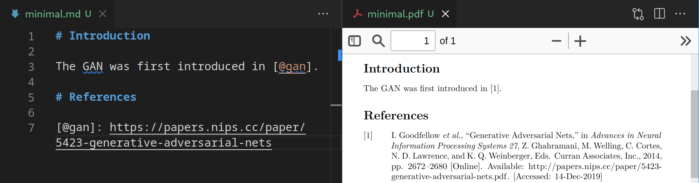
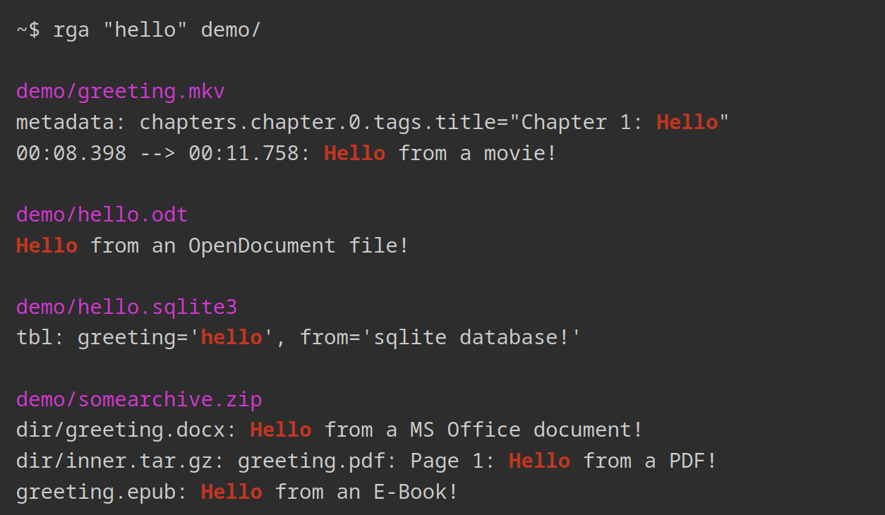

## Hi there 👋

I'm a big fan of FOSS and develop and maintain a few tools as side-projects.

Here's some of my open-source work (most recent first):

### sqlite-zstd: Transparent dictionary-based row-level compression for SQLite

- Article: https://phiresky.github.io/blog/2022/sqlite-zstd/
- Repo: https://github.com/phiresky/sqlite-zstd
- Technologies: Rust

### timetrackrs: An automated rule-based timetracker (WIP)

- Screenshot:  
  
- Repo: https://github.com/phiresky/timetrackrs
- Technologies: Rust, SQLite, Typescript, React

### sql.js-httpvfs: Hosting SQLite databases on Github Pages

- Article: https://phiresky.github.io/blog/2021/hosting-sqlite-databases-on-github-pages/

- Technologies: TypeScript, React, SQLite, WebWorkers

### pandoc-url2cite: Effortlessly and transparently add correctly styled citations to your markdown paper given only a URL

- Screenshot: 
- Article: https://phiresky.github.io/blog/2019/pandoc-url2cite/
- Repo: https://github.com/phiresky/pandoc-url2cite
- Technologies: TypeScript

### ripgrep-all: ripgrep, but also search in PDFs, E-Books, Office documents, zip, tar.gz, etc.

- Screenshot: 
- Article: https://phiresky.github.io/blog/2019/rga--ripgrep-for-zip-targz-docx-odt-epub-jpg/
- Repo: https://github.com/phiresky/ripgrep-all
- Technologies: Rust

### Backchannel Prediction for Conversational Speech Using Recurrent Neural Networks

- Screenshot: 
- Repo: https://github.com/phiresky/backchannel-prediction
- Technologies: Python, TypeScript
<!--
**phiresky/phiresky** is a ✨ _special_ ✨ repository because its `README.md` (this file) appears on your GitHub profile.

Here are some ideas to get you started:

- 🔭 I’m currently working on ...
- 🌱 I’m currently learning ...
- 👯 I’m looking to collaborate on ...
- 🤔 I’m looking for help with ...
- 💬 Ask me about ...
- 📫 How to reach me: ...
- 😄 Pronouns: ...
- ⚡ Fun fact: ...
  -->
